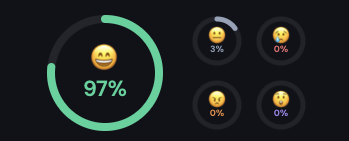

<p align="center">
  
</p>

<h1 align="center">☺ HappyFace</h1>

<p align="center">
  <strong>Smiling is good for your health.</strong><br>
  Real-time emotion recognition as a macOS menubar app — local, private, science-backed.
</p>

<p align="center">
  <a href="#features">Features</a> •
  <a href="#science">Science</a> •
  <a href="#installation">Installation</a> •
  <a href="#download">Download</a>
</p>

---

## The Problem

Working from home, you lose the social mirror. No one tells you that you've been frowning for hours. Research shows that unconscious negative facial expressions reinforce negative emotions — a vicious cycle that raises cortisol and lowers productivity.

## The Solution

**HappyFace** lives invisibly in your macOS menubar and analyzes your facial expressions in real time — gently, privately, and without interrupting your flow. A colored dot shows you how you're doing at a glance:

- 🟢 **Green** — You're beaming. Keep it up.
- 🟡 **Yellow** — Neutral. Time for a micro-break?
- 🔴 **Red** — Tense. Take a conscious breath.

## Features

| | Feature | Description |
|---|---|---|
| ⚡ | **Live Detection** | Real-time facial analysis — up to 10× per second |
| 📈 | **Timeline** | Track your mood over 60s, 60min, 24h, or 7 days |
| 🎯 | **Smart Tray Icon** | Menubar icon changes color live based on dominant emotion |
| 😊 | **Multi-Emotion** | Tracks 7 emotions: Happy, Sad, Angry, Surprised, Fearful, Disgusted, Neutral |
| 🔥 | **Streak Tracker** | Consecutive days with a positive average |
| 💡 | **Smart Nudges** | Motivational tips when your mood dips |
| 📊 | **Statistics** | Daily average, peak, 7-day overview |
| 🔒 | **100% Local** | No cloud, no servers, no data leaves your device |

## Science

The connection between facial expressions, emotions, and health is well-established:

- **Facial Feedback Hypothesis** — Smiling directly influences how we experience emotions. Confirmed in a mega-study with 3,878 participants across 19 countries ([Nature Human Behaviour, 2022](https://www.nature.com/articles/s41562-022-01458-9))
- **+13% Productivity** — Happy workers are measurably more productive ([Oxford Saïd Business School](https://www.ox.ac.uk/news/2019-10-24-happy-workers-are-13-more-productive))
- **Lower Cortisol** — Genuine smiling (Duchenne smile) reduces cortisol levels and boosts immune function ([PubMed, Soussignan 2002](https://pubmed.ncbi.nlm.nih.gov/12899366/))

## Tech Stack

| Technology | Purpose |
|---|---|
| [Tauri 2](https://v2.tauri.app) | Lightweight desktop app (~15MB vs 200MB+ Electron) |
| [face-api.js](https://github.com/vladmandic/face-api) | Expression detection with tiny models (~800KB) |
| React 18 + TypeScript | Frontend |
| Recharts | Timeline visualization |
| Vite 6 | Build tool |
| Rust | Backend (tray icon, window management) |

## Installation

### Prerequisites

- [Rust](https://rustup.rs/) (stable)
- [Node.js](https://nodejs.org/) ≥ 18
- macOS 13+ (camera permission required)

### Development

```bash
# Install dependencies
npm install

# Download face-api.js models
npm run download-models

# Start dev mode (Vite + Tauri)
npm run tauri dev
```

### Production Build

```bash
npm run tauri build
```

This produces `HappyFace.app` and `HappyFace.dmg` in `src-tauri/target/release/bundle/`.

### Camera Permission

On first launch, macOS will ask for camera access. If denied:
**System Settings → Privacy & Security → Camera → Enable HappyFace**

## Architecture

```
happyface/
├── src/                        # React Frontend
│   ├── components/
│   │   ├── HappinessGauge.tsx  # SVG ring gauge + mini emotion circles
│   │   ├── Timeline.tsx        # Multi-range Recharts timeline
│   │   └── StatsPanel.tsx      # Streak, stats, week bars
│   ├── hooks/
│   │   ├── useFaceDetection.ts # Camera + face-api.js (100ms interval)
│   │   └── useCameraWatcher.ts # Video call detection
│   ├── utils/
│   │   ├── types.ts            # TypeScript types
│   │   └── storage.ts          # localStorage persistence
│   ├── App.tsx                 # Main app + tray icon updates
│   └── styles.css              # Dark theme
├── src-tauri/                  # Tauri Backend (Rust)
│   ├── src/main.rs             # Dynamic tray icon + window
│   ├── tauri.conf.json         # App config
│   └── Entitlements.plist      # macOS camera entitlement
├── landing/                    # Marketing landing page
│   └── index.html              # Standalone HTML
└── public/models/              # face-api.js models (~800KB)
```

## Privacy

- **Fully local** — No data ever leaves your device
- **No cloud** — No accounts, no servers, no sign-up
- **Camera frames** stay in the browser context, never saved to disk
- **Only scores** are persisted in localStorage

## Resource Usage

| Metric | Value |
|---|---|
| RAM | ~80–120 MB |
| CPU | ~2–5% at 100ms interval |
| App size | ~15 MB |
| Models | ~800 KB |

## Download

> **[→ Latest Release](https://github.com/langner030/happyface/releases/latest)**

Download the `.dmg`, open it, and drag HappyFace into your Applications folder.

---

<p align="center">
  Made with ☺ in Germany 🇩🇪
</p>
